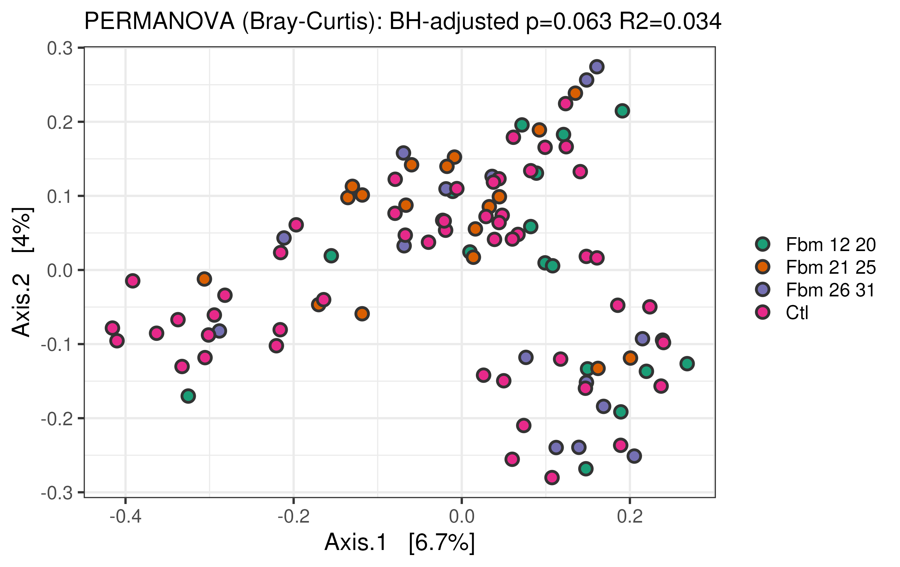

# Gut microbiome variation across fibromyalgia symptom severity

Requires Docker version 29.3.0 or later and at least 2 available threads.
The pipelie will pull the appropriate Docker images automatically.
Assumes the FastQ files have been placed within the `fastq/` direcotry. Each step is annotated within the script itself.

# Run Qiime2 analysis

```{bash}
./run_qiime2.sh
```

The outputs will be written to the current project directory.

# Reproducing figures

The `extra/phyloseq.rds` file is a Phyloseq object which can be used to recreate plots and other outputs.
For example, to perform beta diversity analysis (PERMANOVA + PCoA) in R (v. 4.3.0 or later):

```{r}
library(ggplot2)
library(phyloseq)
library(here)

p <- readRDS(here("extra/phyloseq.rds"))

# normalize to proportions
p_prop <- transform_sample_counts(p, function(x) x / sum(x))

# calculate Bray-Curtis dissimilarity
bray <- distance(p_prop, method = "bray")

# create ordination (PCoA)
ord <- ordinate(p_prop, method = "PCoA", distance = "bray")

# Plot PCoA
plot_ordination(p_prop, ord) +
    scale_fill_brewer(palette = "Dark2") +
    geom_point(size = 4, pch = 21, aes(fill = group)) +
    theme_bw(base_size = 22)

# Run PERMANOVA
permanova <- vegan::adonis2(bray~group, data=data.frame(p_prop@sam_data),permutations = 2e4)
print(permanova)
```


The results should resemble the plot below (without BH adjustment).


